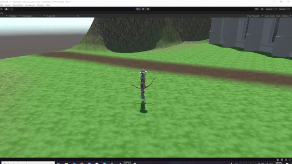
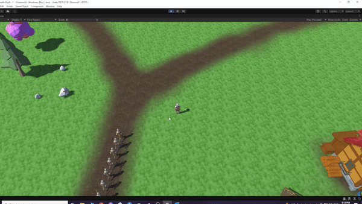

# Growth-Rush
Growth Rush is a project that I made over the course of 5 months during my free time after work. 
The knoweldge comes mostly from my own research and also two online lessons that I took on Udemy.

<strong>The intended design:</strong>
The final goal would be a single-player moba, where the player starts in a base on a mirrored map and the other base is controlled by AI.
The player must help his troops push against the AI's troop, either through direct combat or by purchasing upgrades.

<strong>The troops.</strong>
 
 
The script responsible for spawning the troops is Scripts/Core/TroopSpawner.cs.
In this script I decided to try my hand at asynchronous functions instead of coroutines, mostly for fun but also because coroutines are native to unity.
  
 
Here we see the original line of troops that spawn from a base dividing into two. Each ai combatant has a patrol path prafab assgined to it.
I have a simple patrol path script that draw gizmos to facilitate design as well as a contain few methods used by the ai controller.
More in Scripts/Control/PatrolPath.cs
  
 
Fast forward a minute later and the opposing troops meet in the middle of the map, on one of the two roads.
If you look carefully, you can see that I have no talent for art.
  

